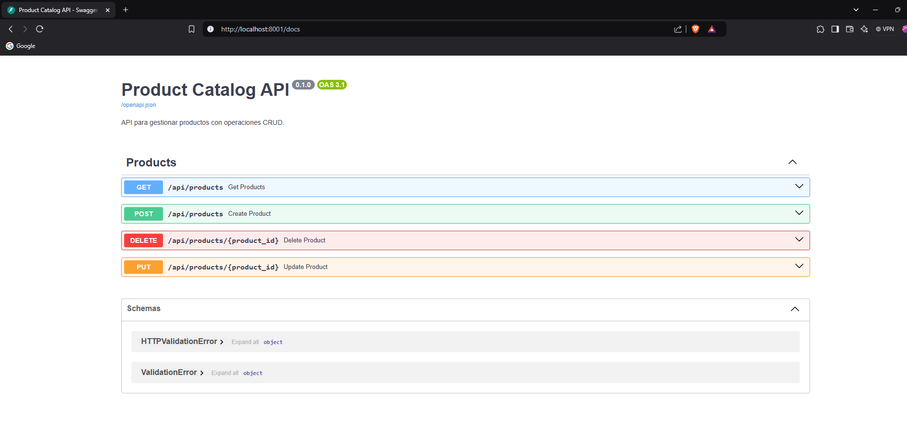
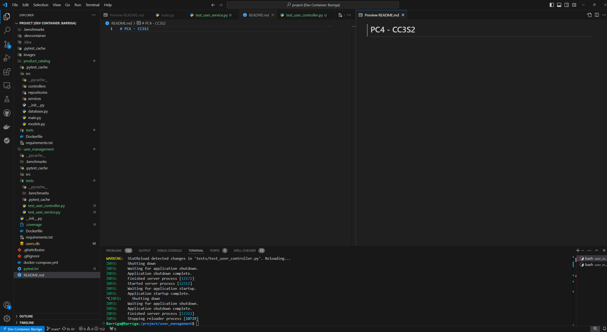

# PC4 - CC3S2

## Uso de los principios SOLID

En mi proyecto, sigo los principios **SOLID** para garantizar modularidad, escalabilidad y facilidad de mantenimiento:

1. **Responsabilidad Única (SRP):** Cada clase y módulo tiene una única responsabilidad. Por ejemplo, los controladores gestionan las rutas de la API, mientras que los servicios manejan la lógica del negocio.

2. **Abierto/Cerrado (OCP):** Las clases están diseñadas para ser extendidas sin modificar su implementación original. Por ejemplo, los servicios permiten añadir nuevas funcionalidades sin alterar el código existente.

3. **Sustitución de Liskov (LSP):** Las dependencias se gestionan mediante abstracciones, garantizando que los objetos derivados puedan sustituir a sus clases base sin romper la funcionalidad.

4. **Segregación de Interfaces (ISP):** Los servicios y controladores solo exponen métodos necesarios, evitando interfaces demasiado grandes que incluyan funcionalidades innecesarias.

5. **Inversión de Dependencias (DIP):** Utilizo inyección de dependencias para desacoplar las clases de sus implementaciones concretas, permitiendo una mayor flexibilidad y testabilidad.

## Estructura del proyecto

El proyecto está organizado en diferentes carpetas:

- **controllers:** Contiene los controladores de la API.
- **models:** Define los modelos de datos de la aplicación.
- **routes:** Define las rutas de la API.
- **services:** Contiene la lógica de negocio de la aplicación.
- **user_management:** Contiene el 1er Proyecto
- **product_catalog**: Contiene el 2do Proyecto
- **Dockerfile:** Define la imagen de Docker para la aplicación.
- **docker-compose.yml:** Define los servicios de la aplicación.
- **tests/**: Contiene los tests de la aplicación.

## Imagenes de la aplicación

## Uso de Devcontainer

